# Hi 👋, I'm Shreeja

### 🤖 Aspiring AI/ML Engineer | Java Backend Developer

💡 Computer Science student passionate about **Artificial Intelligence, Machine Learning, and Software Engineering**.

- 🔭 Building **ConveyorBeltV2** (ML Predictive Maintenance) & **PixelVaultV2** (Full-Stack Digital Asset Marketplace)
- 📑 Currently researching about Efficient Placement of Virtual Machines in Cloud Servers
- 🌱 Learning **Machine Learning, Deep Learning, NLP, Computer Vision, AI Agents, LLMs, Python for AI & AWS**
- 👯 Open to collaborating on **AI/ML, Backend Development & Open Source**
- 🎯 Currently improving **DSA, System Design & MLOps**
- 📫 **spkarajagi2006@gmail.com**
- 📄 [Resume](https://drive.google.com/file/d/1yOGYN1mulWZto0r1pDXGD4NFR_64x8-T/view?usp=sharing)

## 🌐 Connect

## 💻 Tech Stack

**Languages**

**AI / ML**

**Backend & Cloud**

## 📊 GitHub Stats

